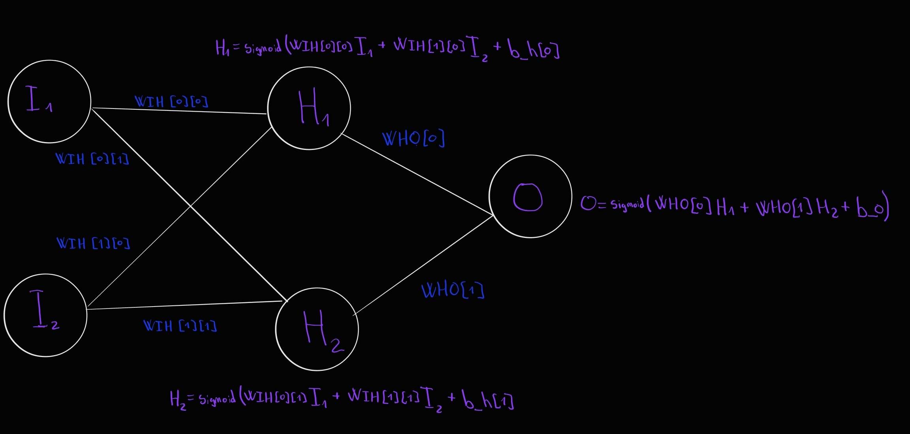
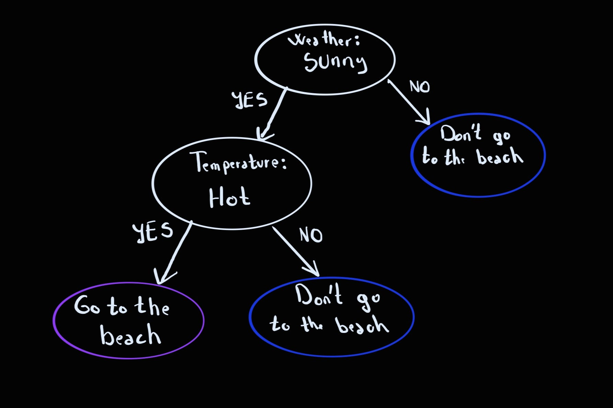

# my-ai-learning-journey-from-scratch
A self-taught deep dive into the foundations of AI. Documenting my journey of building algorithms from scratch to understand the math and mechanics behind how AI actually learns.
Most of my projects will be in C++

Some simple projets:
1. ## Linear Decision Boundary
    - **Project Goal:** The algorithm learns whether the sum of two numbers is greater than or less than 100 using supervised learning.
    - **Classification Rules:**  
        >1 -> (x1 + x2 > 100)  
        0 -> (x1 + x2 < 100)
    - **Implementation Details:** It implements a single-layer Perceptron from scratch to find the optimal weights and bias for a linear decision boundary. The model is trained on a synthetic dataset of 10,000 generated coordinates $(x_1, x_2)$, where each point is labeled based on whether its sum exceeds a threshold of 100 ($x_1 + x_2 > 100$). By utilizing a basic threshold activation function and adjusting the weights ($w_1, w_2, w_3$) incrementally through supervised learning steps governed by a learning rate ($\alpha = 0.0005$), the algorithm iteratively minimizes classification errors over 40 epochs. Ultimately, the code successfully learns to approximate the mathematical boundary dividing the two data classes.
2. ## Nonelinear Regression Carprice
    - **Project Goal:** The algorithm learns to predict the resale price of a used car based on three input features—purchase price, age, and mileage—using supervised non-linear regression.
    - **Mathematical Framework:** The model utilizes an exponential decay structure to mirror real-world automotive depreciation, ensuring that estimated asset valuations scale realistically and never drop below zero. It is expressed as:
      > $$\Large predictedPrice = w_0 \cdot \left(\frac{price}{300000}\right) \cdot e^{-w_1 \cdot \left(\frac{year}{30}\right)} \cdot e^{-w_2 \cdot \left(\frac{mileage}{300000}\right)} \cdot 300000$$
    - **Implementation Details:** It implements a multi-variable non-linear regression model trained from scratch using gradient descent to minimize an L2 Squared Error loss function. The training pipeline automatically generates a synthetic dataset of 2,000 car records with known target parameters ($w_0 = 1.0, w_1 = 3.2, w_2 = 0.08$). To ensure mathematical stability and prevent gradient explosion, all features are normalized via feature scaling during execution. By calculating exact partial derivatives through the calculus Chain Rule and updating the weights ($w_0, w_1, w_2$) incrementally using a learning rate ($\alpha = 0.05$) over 100 epochs, the model successfully converges onto the true underlying parameters and minimizes Mean Absolute Error (MAE).
3. ## Linear Regression With Noise L2 Regularization
    - **Project Goal:** The algorithm learns to approximate a continuous linear baseline relationship from a noisy synthetic dataset using supervised multiple linear regression.
    - **Mathematical Framework:** The model uses a classic linear combination equation to predict targets, adding an explicit $L_2$ regularization penalty (Weight Decay) to actively suppress data noise during optimization. It is expressed as:
      > $$\Large y = w_0 \cdot x + w_1$$
    - **Implementation Details:** It implements a multi-variable linear regression model trained from scratch using Batch Gradient Descent to minimize a Mean Squared Error (MSE) loss metric. The framework automatically streams a dataset of 10,000 synthetic coordinate records based on a hidden ground truth equation ($w_0 = 52.0, w_1 = 13.0$) and injects uniform additive random noise within the closed bounds of $[-5.0, 5.0]$. By calculating precise partial derivatives over the full data batch per iteration, managing floating-point tracking variables to eliminate integer division truncations, and applying a steady decay pressure via a regularization modifier ($\lambda = 0.001$) across 500 training epochs, the algorithm filters past chaotic fluctuations to successfully mirror the original target weights and hit a near-optimal Mean Absolute Error (MAE) limit of $\sim 2.74$.
4. ## k-Nearest Neighbors (k-NN) Three-Circle Classifier
    - **Project Goal:** The algorithm learns to classify multi-class spatial data points across geometric distributions by analyzing local structural density and assigning category labels based on spatial proximity.
    - **Mathematical Framework:** The model is non-parametric and relies on distance-based localized voting rather than explicit weights. To evaluate proximity between an unlabelled query point $q$ and a reference dataset point $p$ in a two-dimensional Euclidean vector space, the engine calculates the standard geometric L2 distance metric. This is mathematically defined as:
        > $$\Large \text{distance}(q, p) = \sqrt{(q.x - p.x)^2 + (q.y - p.y)^2}$$
        >
        > $$\Large P(y = c \mid q) = \frac{1}{k} \sum_{i \in N_k(q)} I(y_i = c)$$
    - **Implementation Details:** This system implements a $k$-Nearest Neighbors ($k$-NN) instance-based classifier built entirely from scratch in C++. The training pipeline automatically synthesizes a dataset containing 120 geometric coordinate clusters distributed symmetrically across three overlapping circular spaces centered at distinct coordinates ($(0, 0)$, $(3, 0)$, and $(1.5, 2.598)$). During execution, the framework calculates the Euclidean distance from a target query to every spatial coordinate vector in the memory matrix, sorts the results using a quick-sort variant, and isolates the top $k$ closest neighbors ($k=5$). The output label is determined via a majority plurality vote from the selected neighbors, enabling highly accurate non-linear classification boundaries without requiring a formal iterative training phase.
5. ## Polynomial Logistic Regression Day/Night Classifier
    - **Project Goal:** The algorithm learns to classify a given hour of the day as either daytime (light) or nighttime (dark) using supervised polynomial logistic regression, successfully capturing multiple temporal thresholds simultaneously.
    - **Mathematical Framework:** Because a single-neuron model cannot inherently separate non-linear data structures (where an island of light is trapped between two periods of darkness), the algorithm expands the input space using a polynomial expansion. By calculating a quadratic feature component ($\text{hour}^2$), the model wraps a parabolic decision boundary around the daylight parameters. The raw hypothesis is pushed through a Sigmoid activation function to map real values to a stable probability distribution between $[0, 1]$. It is expressed as:
        > $$\Large Z = w_0 + w_1 \cdot \left(\frac{\text{hour}}{24}\right) + w_2 \cdot \left(\frac{\text{hour}}{24}\right)^2$$
        >
        > $$\Large Z = w_0 + w_1 \cdot X_1 + w_2 \cdot X_2^2$$
        >
        > $$\Large \text{predicted (Z)} = \frac{1}{1 + e^{-z}}$$
        >
        > $$Loss = - \big[ y \ln(predicted) + (1 - y) \ln(1 - predicted) \big]$$
        >
        > $$\frac{\partial \text{Loss}}{\partial w_j} = \frac{\partial \text{Loss}}{\partial \text{predicted}} \times \frac{\partial \text{predicted}}{\partial z} \times \frac{\partial z}{\partial w_j}$$
        >
        > $$\frac{\partial \text{Loss}}{\partial w_j} = \frac{\text{predicted} - y}{\cancel{\text{predicted}(1 - \text{predicted})}} \times \cancel{\text{predicted}(1 - \text{predicted})} \times \frac{\partial z}{\partial w_j}$$
        >
        > $$\frac{\partial \text{Loss}}{\partial w_j} = (\text{predicted} - y) \times \frac{\partial z}{\partial w_j}$$
        >
        > ---
        >
        > $$w_j \leftarrow w_j - \alpha \cdot \frac{\partial \text{Loss}}{\partial w_j} $$
        >
        > $$w_0 \leftarrow w_0 - \alpha \cdot (predicted - y)$$
        >
        > $$w_1 \leftarrow w_1 - \alpha \cdot (predicted - y) \cdot x$$
        >
        > $$w_2 \leftarrow w_2 - \alpha \cdot (predicted - y) \cdot x^2$$
    - **Implementation Details:** The engine implements a parametric polynomial logistic regression network built entirely from scratch in. The training pipeline dynamically generates a synthetic matrix of 10,000 distinct timestamps, automatically establishing ground-truth boundaries between sunrise (6.00) and sunset (18.00). To avoid gradient saturation across the Sigmoid curves and ensure smooth numeric step adjustments, time values are scaled directly down to a normalized $[0, 1]$ decimal range. Utilizing Stochastic Online Learning paired with Gradient Descent, the network iteratively tunes the feature parameters ($w_0, w_1, w_2$) using a learning rate ($\alpha = 0.01$) over 100 epochs, allowing the model to conform perfectly to the parabolic thresholds and maximize evaluation classification accuracy.
6.  ## Q-Learning Path Finder
    - **Project Goal:** The algorithm learns to navigate an autonomous agent through a 2D grid matrix containing static obstacles, discovering the shortest optimal path from a specific starting position to a designated target destination.
    - **Mathematical Framework:** The system utilizes tabular temporal-difference learning to iteratively optimize a state-action quality table without requiring a model of the environmental transitions. The agent balances exploration and exploitation via an $\epsilon$-greedy strategy governed by a dynamic decay rate. Upon executing an action, the value of a state-action pair is updated by integrating immediate feedback with an estimation of future returns, weighted by a learning rate ($\alpha$) and a discount factor ($\gamma$). The Bellman optimality equation for this value-based transition updates the matrix entry as follows:
        >  $$\Large Q(s, a) \leftarrow Q(s, a) + \alpha \cdot \left[ R(s') + \gamma \cdot \max_{a'} Q(s', a') - Q(s, a) \right]$$
        > * **$Q(s, a)$ (Current Q-Value):** The model's current estimate of the quality or long-term reward of taking action $a$ in state $s$.
        > * **$\alpha$ (Learning Rate):** A value between $0$ and $1$ controlling how fast the agent learns. A higher value updates the Q-value aggressively based on new data; a lower value retains older memory.
        > * **$R(s')$ (Immediate Reward):** The numerical reward or penalty received immediately after transitioning to the new state $s'$.
        > * **$\gamma$ (Discount Factor):** A value between $0$ and $1$ determining the importance of future rewards. Near $0$ makes the agent opportunistic for immediate rewards; near $1$ makes it focus on long-term strategy.
        > * **$\max_{a'} Q(s', a')$ (Maximum Future Value):** The highest possible Q-value achievable from the next state $s'$ by selecting the optimal action $a'$.
        > * **$\left[ R(s') + \gamma \cdot \max_{a'} Q(s', a') - Q(s, a) \right]$ (Temporal Difference / TD Error):** The discrepancy between the estimated total target reward and the old expected reward. This acts as the "surprise factor" driving the update.
    - **Implementation Details:** The engine implements a tabular Q-learning framework object. The training pipeline simulates 1,000 distinct episodic runs where an agent navigates an $8 \times 6$ coordinate topology, encountering a small step penalty ($R = -1$) for normal cell movements, a penalty ($R = -6$) for hitting a wall or a blockade such as "#" and a major validation payout ($R = 100$) upon reaching the target endpoint. To ensure thorough environmental coverage before converging on a deterministic policy, the exploration coefficient ($\epsilon$) initializes at $1.0$ and decays exponentially at a rate of $0.997$ per step down to a baseline floor of $0.03$. After training, the execution loop switches to a purely greedy target policy to reconstruct and print the optimized path route from start ('S') to end ('E') using directional cell tracking markers ('x').
7. ## Multi-Layer Perceptron XOR Gate Classifier
    - **Project Goal:** The algorithm learns to resolve the classic non-linearly separable XOR logical function, training a multi-layer neural network from scratch to map binary input coordinate pairs into their correct single-bit parity outputs.
    - **Mathematical Framework:** Because a single-layer perceptron cannot construct a non-linear decision boundary to isolate the staggered true and false coordinates of an XOR truth table, the system utilizes a 2-2-1 feedforward architecture. Signals cascade through a hidden layer before reaching the output, with every neuron's dot product compressed by a non-linear Logistic Sigmoid function. During backpropagation, optimization gradients are computed via the chain rule to minimize the sum of squared errors ($E$). The error terms ($\delta$) are calculated at the output and distributed backward through the weight matrices using the first derivative of the activation function, expressed as:
        > $$\Large \text{Loss Function} = E = \frac{1}{2}(Y_s - \hat{Y}_s)^2$$
        >
        > $$\Large h_j = \sigma(z_{\text{hidden},j}) = \sigma\left(\sum_{i} (x_i \cdot w_{ij}) + b_j\right) = \frac{1}{1 + e^{-z_{\text{hidden},j}}}$$
        >
        > $$\Large \hat{Y}_s = \sigma(z_{\text{output}}) = \sigma \left( \sum_{j} (h_j \cdot w_j) + b_{\text{output}} \right) = \frac{1}{1 + e^{-z_{\text{output}}}}$$
        >
        > $$\Large \frac{\partial \sigma(z)}{\partial z} = \sigma(z)(1 - \sigma(z))$$
        >
        > ---
        >
        > $`\delta_{\text{hidden},j} = -\frac{\partial E}{\partial z_{\text{hidden},j}} = -\frac{\partial E}{\partial \hat{Y}_s} \cdot \frac{\partial \hat{Y}_s}{\partial z_{\text{output}}} \cdot \frac{\partial z_{\text{output}}}{\partial h_j} \cdot \frac{\partial h_j}{\partial z_{\text{hidden},j}}`$
        >
        > $$\Large = - \frac{\partial}{\partial \hat{Y}_s} \left[ \frac{1}{2}(Y_s - \hat{Y}_s)^2 \right] \cdot \hat{Y}_s(1 - \hat{Y}_s)$$
        >
        > $$\Large = -(-(Y_s - \hat{Y}_s)) \cdot \hat{Y}_s(1 - \hat{Y}_s) = (Y_s - \hat{Y}_s) \cdot \hat{Y}_s(1 - \hat{Y}_s)$$
        >
        > ---
        >
        > $$ \delta_{\text{hidden},j} = -\frac{\partial E}{\partial z_{\text{hidden},j}} = -\frac{\partial E}{\partial \hat{Y}_s} \cdot \frac{\partial \hat{Y}_s}{\partial z_{\text{output}}} \cdot \frac{\partial z_{\text{output}}}{\partial h_j} \cdot \frac{\partial h_j}{\partial z_{\text{hidden},j}}
        > $$
        >
        > $$\Large = (Y_s - \hat{Y}_s) \cdot \hat{Y}_s(1 - \hat{Y}_s) \cdot w_j \cdot h_j(1 - h_j)$$
        >
        > $$\Large = \delta_{\text{output}} \cdot w_j \cdot h_j(1 - h_j)$$
        >
        > ---
        >
        > $$\Large \delta_{\text{output}} = (Y_s - \hat{Y}_s) \cdot \hat{Y}_s(1 - \hat{Y}_s)$$
        >
        > $$\Large \delta_{\text{hidden},j} = \delta_{\text{output}} \cdot w_j \cdot h_j(1 - h_j)$$
        >
        > ---
        >
        > $$\Large \Delta w_j = \alpha \cdot \delta_{\text{output}} \cdot h_j \qquad \text{and} \qquad \Delta b_{\text{output}} = \alpha \cdot \delta_{\text{output}}$$
        >
        > $$\Large \Delta w_{ij} = \alpha \cdot \delta_{\text{hidden},j} \cdot x_i \qquad \text{and} \qquad \Delta b_j = \alpha \cdot \delta_{\text{hidden},j}$$
        >
        > ---
        >
        > * $E$ is the total squared error for a single training sample.
        > * $Y_s$ is the target output (ground truth) for sample $s$.
        > * $\hat{Y}_s$ is the predicted output from the model's output node.
        > * $h_j$ is the activation output of hidden layer neuron $j$.
        > * $\sigma$ is the Sigmoid activation function.
        > * $z_{\text{hidden},j}$ is the pre-activation net input to hidden neuron $j$.
        > * $z_{\text{output}}$ is the pre-activation net input to the output neuron.
        > * $x_i$ is the input value at feature index $i$.
        > * $w_{ij}$ is the weight connecting input $i$ to hidden neuron $j$.
        > * $b_j$ is the bias term for hidden neuron $j$.
        > * $w_j$ is the weight connecting hidden neuron $j$ to the output neuron.
        > * $b_{\text{output}}$ is the bias term for the output neuron.
        > * $\Delta w_j$ is the weight update value for the weight connecting hidden neuron $j$ to the output neuron.
        > * $\alpha$ is the learning rate parameter controlling the step size of optimization.
        > * $\Delta b_{\text{output}}$ is the bias update value for the output layer.
        > * $\Delta w_{ij}$ is the weight update value for the weight connecting input $i$ to hidden neuron $j$.
        > * $\Delta b_j$ is the bias update value for hidden neuron $j$.
        
    - **Implementation Details:** The engine implements a raw feedforward backpropagation neural network engineered entirely without external machine learning dependencies. The network structures its parameter matrices dynamically with random initialization between $[-1, 1]$ across two input nodes, two hidden neurons, and a single output neuron. Utilizing supervised batch-epoch processing over 10,000 learning iterations, the trainer systematically minimizes global error using a fixed learning rate ($\eta = 0.5$). Weights ($w$) and biases ($b$) are simultaneously adjusted at each step according to the computed localized gradients, ensuring the final network successfully pushes its classification thresholds to isolate the non-linear XOR vectors.

8. ## Multiclass Iris Classifier Neural Network
    - **Project Goal:** The algorithm learns to classify physical Iris flower samples into one of three distinct biological species (*Iris setosa*, *Iris versicolor*, or *Iris virginica*) based on four continuous anatomical feature measurements extracted from an imported dataset file.
    - **Mathematical Framework:** The system utilizes a fully connected Feedforward Neural Network architecture optimized via supervised Gradient Descent and Backpropagation. The output distribution is normalized into mutually exclusive probabilities using the Softmax activation function. Network errors are evaluated using a categorical cross-entropy derivative formulation. When a pattern propagates through the system, weights and biases are iteratively updated by projecting errors backward layer-by-layer, scaling adjustments by the local sensitivity curve of the hidden nodes. The mathematical update rule for minimizing the network error matrix entry is governed by the generalized delta rule:
        > $$\text{Loss Function} = E = -\sum_{k} Y_{s,k} \ln(\hat{Y}_{s,k})$$
        >
        > $$\Large h_j = \sigma(z_{\text{hidden},j}) = \sigma\left(\sum_{i} (x_i \cdot w_{ij}) + b_j\right) = \frac{1}{1 + e^{-z_{\text{hidden},j}}}$$
        >
        > $$\Large \hat{Y}_{s,k} = \text{softmax}(z_{\text{output},k}) = \frac{e^{z_{\text{output},k}}}{\sum_{m} e^{z_{\text{output},m}}}$$
        >
        > $$\Large \frac{\partial \sigma(z)}{\partial z} = \sigma(z)(1 - \sigma(z))$$
        >
        > ---
        >
        > $$\Large \delta_{\text{output},k} = \frac{\partial E}{\partial z_{\text{output},k}} = \hat{Y}_{s,k} - Y_{s,k}$$
        >
        > $$\Large \delta_{\text{hidden},j} = \frac{\partial E}{\partial z_{\text{hidden},j}} = \sum_{k} \left( \frac{\partial E}{\partial z_{\text{output},k}} \cdot \frac{\partial z_{\text{output},k}}{\partial h_j} \right) \cdot \frac{\partial h_j}{\partial z_{\text{hidden},j}}$$
        >
        > $$\Large = \sum_{k} \left( \delta_{\text{output},k} \cdot w_{jk} \right) \cdot h_j(1 - h_j)$$
        >
        > $$\Large = \left( \sum_{k} \delta_{\text{output},k} \cdot w_{jk} \right) \cdot h_j(1 - h_j)$$
        >
        > ---
        >
        > $$\Large \delta_{\text{output},k} = \hat{Y}_{s,k} - Y_{s,k}$$
        >
        > $$\Large \delta_{\text{hidden},j} = \left( \sum_{k} \delta_{\text{output},k} \cdot w_{jk} \right) \cdot h_j(1 - h_j)$$
        >
        > ---
        >
        > $$\Large \Delta w_{jk} = -\alpha \cdot \delta_{\text{output},k} \cdot h_j \qquad \text{and} \qquad \Delta b_{\text{output},k} = -\alpha \cdot \delta_{\text{output},k}$$
        >
        > $$\Large \Delta w_{ij} = -\alpha \cdot \delta_{\text{hidden},j} \cdot x_i \qquad \text{and} \qquad \Delta b_j = -\alpha \cdot \delta_{\text{hidden},j}$$
        >
        > ---
        >
        > * $E$ is the Categorical Cross-Entropy loss for a single training sample.
        > * $Y_{s,k}$ is the target ground truth probability for class $k$ of sample $s$ (`sample.target[i]`).
        > * $\hat{Y}_{s,k}$ is the Softmax predicted probability for class $k$ (`outputNeuron[i]`).
        > * $h_j$ is the activation output of hidden layer neuron $j$ (`hiddenNeuron[i]`).
        > * $\sigma$ is the Sigmoid activation function applied to the hidden layer.
        > * $z_{\text{hidden},j}$ is the pre-activation net input to hidden neuron $j$.
        > * $z_{\text{output},k}$ is the pre-activation net input to output neuron $k$.
        > * $x_i$ is the input value at feature index $i$ (`inputNeuron[i]`).
        > * $w_{ij}$ is the weight connecting input $i$ to hidden neuron $j$ (`WIH[i][j]`).
        > * $b_j$ is the bias term for hidden neuron $j$ (`biasHidden[i]`).
        > * $w_{jk}$ is the weight connecting hidden neuron $j$ to output neuron $k$ (`WHO[j][i]`).
        > * $b_{\text{output},k}$ is the bias term for output neuron $k$ (`biasOutput[i]`).
        > * $\delta_{\text{output},k}$ is the calculated error term for output neuron $k$ (`outputError[i]`).
        > * $\delta_{\text{hidden},j}$ is the calculated gradient/error term for hidden neuron $j$ (`hiddenError[i]`).
        > * $\alpha$ is the learning rate parameter controlling optimization step sizes (`learningRateAlpha`).
        > * $\Delta w_{jk}$ is the update amount subtracted from the hidden-to-output weight matrix.
        > * $\Delta b_{\text{output},k}$ is the update amount subtracted from the output layer bias vector.
        > * $\Delta w_{ij}$ is the update amount subtracted from the input-to-hidden weight matrix.
        > * $\Delta b_j$ is the update amount subtracted from the hidden layer bias vector.
    - **Implementation Details:** The engine compiles a structured 3-layer multilayer perceptron object (`4` inputs $\rightarrow$ `14` hidden units $\rightarrow$ `3` outputs). The structural training pipeline processes an input CSV source dataset containing 150 instances, parsing flower dimensions into a customized data struct object (`IrisSample`). Target labels are mapped directly onto orthogonal One-Hot encoded arrays. To prevent model saturation and weight bias loops, the data collection is mixed uniformly before processing using a stochastic pseudo-random engine shuffle. The runtime network trains across `500` continuous processing epochs using stochastic in-place matrix operations, continuously tuning structural weight layers (`WIH`, `WHO`) and threshold bias arrays until output probabilities consistently match raw flower categories.
9. ## Decision Tree Binary Beach Classifie
    - **Project Goal:** The algorithm learns to recursively partition a categorical dataset of environmental observations into pure sub-segments to predict whether an individual will visit the beach based on structural information gain.
    - **Mathematical Framework:** The model is a parametric classification tree that uses Gini Impurity to evaluate the quality of categorical splits. At any given node with $C$ unique target classes, where $p_i$ represents the probability of a sample belonging to class $i$, the Gini Impurity $I_G$ is calculated as:
        > $$I_G(p) = 1 - \sum_{i=1}^{C} p_i^2$$
        >
        > $$I_G(\text{Split}) = \frac{N_{\text{left}}}{N_{\text{total}}} I_G(\text{left}) + \frac{N_{\text{right}}}{N_{\text{total}}} I_G(\text{right})$$
    - **Implementation Details:** This system implements a binary Decision Tree classifier completely from scratch in C++. The training pipeline processes a categorical dataset containing environmental attributes (Weather, Temperature, and Weekend flags) mapped to a binary target class (goToBeach). During execution, the engine iteratively scans every feature branch inside findBestSplit using independent lexical scoping blocks to compute regional Gini indices. The dataset is recursively divided into left and right subset vectors to construct an explicit pointer-based tree structure (Node*) until max depth or total class purity is reached, enabling clean non-linear decision boundary printing via structured console indentation logs.
    
        |Weather | Temperature | Weekend | Will Go to Beach? |
        | :--- | :--- | :--- | :--- |
        | Sunny | Hot | Yes | Yes |
        | Sunny | Hot | No | Yes |
        | Rainy | Cool | Yes | No |
        | Sunny | Cool | Yes | No |
        | Rainy | Hot | No | No |
        | Sunny | Hot | Yes | Yes |
        | Sunny | Hot | No | Yes |

        

3. ## Nonlinear Classification SVMProject 
    - **Goal:** The algorithm learns to classify 2D coordinate positions into binary classes ($1$ or $-1$) based on whether they fall inside or outside a circular boundary layout using supervised non-linear classification.
    - **Mathematical Framework:** The model maps non-linearly separable coordinates into an infinite-dimensional feature space using a Radial Basis Function (RBF) Gaussian kernel. Predictions are driven by a dual-form scoring system where active importance weights ($\alpha$) scale the local proximity impact of critical boundary points. It is expressed as:
    $$\Large f(x_i) = \sum_{j=1}^{n} \alpha_j y_j e^{-\gamma \|x_j - x_i\|^2}$$
    - **Implementation Details:** It implements a soft-margin Support Vector Machine trained from scratch using the Pegasos stochastic gradient descent framework to optimize a hinge loss metric. The pipeline automatically constructs a synthetic dataset consisting of 600 training and 200 testing records distributed across a localized coordinate field ($[-15, 15]$) where a radius limit ($x^2 + y^2 \le 100$) determines the true labels. To maximize the geometric soft-margin separation gap and penalize boundary violations, individual point importance metrics are selectively modified during training. By tracking global optimization maturity over multiple epochs via a shared time clock ($t$) and conditionally injecting inverse step-size parameters ($\frac{1}{\lambda \cdot t}$) into violating coordinates, the system compresses the boundary data into a sparse collection of active Support Vectors and extracts high evaluation accuracy scores.